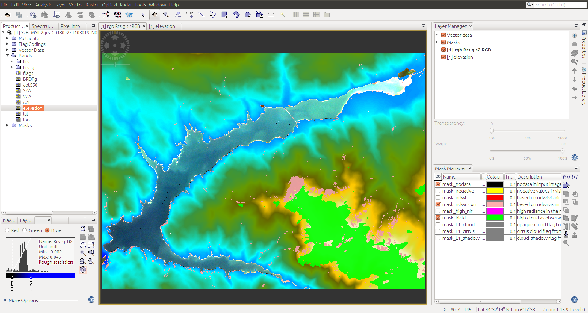
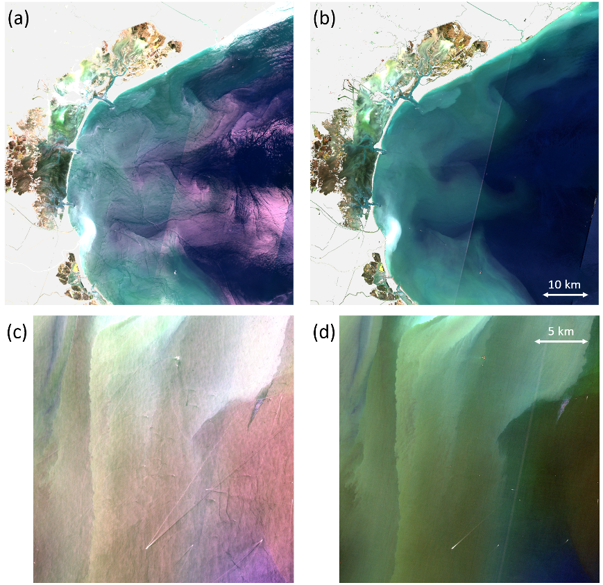

# GRS algorithm package
## GRS (Glint Removal for Sentinel-2-like sensors)

Please check [grs documentation](./docs/build/html/index.html)

The GRS (Glint Removal for Sentinel-2) algorithm [Harmel et al., 2018](https://www.sciencedirect.com/science/article/pii/S0034425717304856)
was specifically developed to
handle and correct for the direct sunlight reflected by the water surface and potentially reaching the sensor (i.e.,
sunglint signal) of Sentinel-2-like mission, that is nadir or near-nadir viewing sensor with SWIR bands. The GRS
processor consists of three main modules to correct for (i) gaseous absorption, (ii) diffuse light from sky and its
reflection by the air-water interface and (iii) the sunglint signal in order to retrieve the water-leaving signal at the
water surface level. 

First, the gaseous absorption (mainly CO2, H2O and O3) correction is performed based on parameterizations of the gas transmittances from full radiative transfer
computations using lidRadtran v2.0.4. Atmospheric pressure and gas concentrations are retrieved from bilinear
interpolation within the grid of the Copernicus Atmosphere Monitoring Service dataset (CAMS). Then, spectral radiances
are corrected for the diffuse sky light and its reflection on the air-water interface. For each pixel, the diffuse
radiance component is reconstructed for the given viewing geometry (i.e., sensor and Sun viewing angles and relative
azimuth) from pre-computed look-up tables (LUT). The Rayleigh optical thickness is rescaled based on the actual pressure
at the scene level to take into account the effects of the altitude on the scattering properties of the atmosphere.
Those LUTs were generated based on the radiative transfer model OSOAA (Chami et al., 2015) for a typical fine and coarse
mode aerosol models, encompassing weakly absorbing ones (Levy et al., 2009), and including the specific spectral
response of the sensor bands. The atmosphere plus surface diffuse signal $`L_{sky}`$ is obtained considering a bimodal aerosol
model (Wang & Gordon, 1994) as follows:


where $`L_{sky}^{fine}`$ and $`L_{sky}^{coarse}`$are the radiances for the fine and coarse aerosol modes, respectively, 
for the aerosol optical thickness $`\tau _a`$; $`\gamma`$ is
the mixing coefficient corresponding to the relative amount of each mode in the atmosphere. Note that $`\tau _a`$ is obtained from
the CAMS dataset (Benedetti et al., 2008; Morcrette et al., 2009) and $`\gamma`$ is retrieved from non-linear fitting including the
LUT aerosol parameters with the spectral values of $`\tau _a`$ provided by CAMS. 

Regarding the sunglint correction, the main
principle is to estimate the bidirectional reflectance distribution function (BRDF) of the rough air-water interface
from the SWIR bands (i.e., ~1610 and ~2200 nm). The sunglint signal obtained in the SWIR is then extrapolated toward the
NIR and visible bands. Estimation of the sunglint radiance is based on the fact that water body is virtually totally
absorbing; water absorption coefficient in the SWIR is several orders of magnitude greater than that in the NIR. Once
corrected for atmosphere diffuse radiance, the remaining radiance in the SWIR is interpreted as the pure surface
component of the signal and then translated into BRDF. This BRDF in the SWIR is extrapolated to the other bands
considering the spectral variation of the refractive index of water and its important consequences onto the spectral
sunglint signal (see [Harmel et al., 2018](https://www.sciencedirect.com/science/article/pii/S0034425717304856) for details). The sunglint radiation is calculated for each pixel, for each
band, considering the estimated BRDF, atmosphere direct transmittance and the extraterrestrial sun radiance reaching the
atmosphere, and the water-leaving radiance is then corrected by removing this value. 

The water-leaving component at the
water surface level is eventually obtained after division by the total transmittance (i.e., diffuse + total
transmittances) calculated for the bimodal aerosol model from the LUT. The version used here accounts for the spectral
response of each band of Sentinel-2 A and B as well as Landsat-8 and it is based on the CAMS aerosol data for the
spectral value of $`\tau _a`$.


## Getting Started

## Installation on TREX (CNES)
1. First install GRSdriver from https://gitlab.cnes.fr/waterquality/io/GRSdriver following the README instruction.
You should have now a conda environment called grs_cnes up.

2. First clone the repository (from https or ssh):
```commandline
git clone https://gitlab.cnes.fr/waterquality/grs2.git
```
or
```commandline
git clone git@gitlab.cnes.fr:waterquality/grs2.git
```

And go on Branch v2.1
```commandline
git checkout v2.1
```

3. Make sure that the grsdata variable is set as follows in the config.yml file:
```commandline
grsdata: '/work/datalake//watcal/GRS/grsdata_v21'
```

4. To complete installation please activate your conda grs_cnes environment as follows:
```commandline
ml conda
conda activate grs_cnes
pip install .
```

You are done, please check [Testing](#testing)
  

## Installation on other machine
These instructions will get you a copy of the project up and running on your local machine for development and testing purposes. See deployment for notes on how to deploy the project on a live system.

### Download the LUT files:
click  on [grsdata](https://drive.google.com/drive/folders/1N0-FtW-PTPblR4z-82fFrUTekMd8e3Vz?usp=sharing)
 to download and save in your desired path (your_GRSDATA_PATH) 

### please use conda environment
``` 
conda activate "name of your conda env"
```

Python >= 3.9 is recommended, example:
``` 
conda create python=3.10 -n grs_v2
conda activate grs_v2
```
Then, install python dependencies:
``` 
conda install -c conda-forge eoreader cdsapi netCDF4 docopt xmltodict numba
```
Set the `config.yml` file:
```
path:
  grsdata: your_GRSDATA_PATH
``` 

Finally, install grs with:
```commandline
pip install .
```

## Testing <a name="testing"></a>

After installation, you can type:
```commandline
grs -h
```

You should see something like:
```commandline
Executable to process Sentinel-2 L1C images for aquatic environment

Usage:
  grs <input_file> [--cams_file file] [-o <ofile>] [--odir <odir>] [--resolution res] [--scale_aot factor]   [--levname <lev>] [--no_clobber] [--allpixels] [--surfwater file] [--dem_file file] [--snap_compliant]
  grs -h | --help
  grs -v | --version

Options:
  -h --help        Show this screen.
  -v --version     Show version.

  <input_file>     Input file to be processed

  --cams_file file     Absolute path of the CAMS file to be used (mandatory)

  -o ofile         Full (absolute or relative) path to output L2 image.
  --odir odir      Ouput directory [default: ./]
  --levname lev    Level naming used for output product [default: L2Agrs]
  --no_clobber     Do not process <input_file> if <output_file> already exists.
  --resolution=res  spatial resolution of the scene pixels
  --allpixels      force to process all pixels whatever they are masked (cloud, vegetation...) or not
  --surfwater file  Absolute path of the surfwater geotiff file to be used
  --dem_file file  Absolute path of the DEM geotiff file (already subset for the S2 tile)
  --scale_aot factor scaling factor applied to CAMS aod550 raster
                    [default: 1]
  --opac_model name  Force the aerosol model (OPAC) to be 'name'
                    (choice: ['ARCT_rh70', 'COAV_rh70', 'DESE_rh70',
                                'MACL_rh70', 'URBA_rh70'])
  --snap_compliant  Export output to netcdf aligned with "beam" for ESA SNAP software

  Example:
      grs /data/satellite/S2/L1C/S2B_MSIL1C_20220731T103629_N0400_R008_T31TFJ_20220731T124834.SAFE --cams_file /data/satellite/S2/cnes/CAMS/2022-07-31-cams-global-atmospheric-composition-forecasts.nc --resolution 60
  For CNES datalake:
      grs /work/datalake/S2-L1C/31TFJ/2023/06/16/S2B_MSIL1C_20230616T103629_N0509_R008_T31TFJ_20230616T111826.SAFE --cams_file /work/datalake/watcal/ECMWF/CAMS/2023/06/16/2023-06-16-cams-global-atmospheric-composition-forecasts.nc --odir /work/datalake/watcal/test --resolution 20 --dem_file /work/datalake/static_aux/MNT/COP-DEM_GLO-30-DGED_S2_tiles/COP-DEM_GLO-30-DGED_31TFJ.tif
```

If you are on TREX CNES you can run the grs example using a SLURM interactive job:
```commandline
unset SLURM_JOB_ID
srun -A cnes_level2 -N 1 -c 8 --time=02:00:00 --mem=64G --x11 --pty bash
ml conda
conda activate grs_cnes
grs /work/datalake/S2-L1C/31TFJ/2023/06/16/S2B_MSIL1C_20230616T103629_N0509_R008_T31TFJ_20230616T111826.SAFE --cams_file /work/datalake/watcal/ECMWF/CAMS/2023/06/16/2023-06-16-cams-global-atmospheric-composition-forecasts.nc --odir /work/datalake/watcal/test --resolution 20 --dem_file /work/datalake/static_aux/MNT/COP-DEM_GLO-30-DGED_S2_tiles/COP-DEM_GLO-30-DGED_31TFJ.tif 
```

### Script for installation on the HAL CNES HPC:
```commandline
# set your grs path here
your_path_to_grs=/work/scratch/$USER/dev/grs

cd $your_path_to_grs
git clone git@gitlab.cnes.fr:waterquality/grs2.git
ml conda/4.12.0
mkdir /work/scratch/$USER/tmp
export TMPDIR=/work/scratch/$USER/tmp
conda create python=3.10 -n grs_v2
conda activate grs_v2
conda install gdal geopandas -c conda-forge-remote
pip install cdsapi netCDF4 matplotlib docopt xarray dask dask[array] toolz>=0.8.2 affine xmltodict bokeh eoreader lxml numba
ml gcc
make
pip install .

grs -h
```


### To download CAMS data
[Register](https://apps.ecmwf.int/registration/) and [ask for a key](https://confluence.ecmwf.int/display/WEBAPI/Accessing+ECMWF+data+servers+in+batch#AccessingECMWFdataserversinbatch-key) to use ECMWF API


### On the PBS cluster : installing from sources with conda on the cluster CNES

Create the conda environment using the definition file available in the conda folder :
```
conda env create -f conda/grs_conda_3.6.yml -p /work/scratch/$user/grs_py3.6
```
The option -p set the directory where the conda environment will be installed

To install the package grs in conda :

```
source conda/conda_grs.sh -ci
```


To launch GRS on a pbs node :

```
qsub launch_grs_exemple.pbs
```

## Running the tests
From terminal:
```
grs test/data/S2B_MSIL1C_20180927T103019_N0206_R108_T31TGK_20180927T143835.SAFE --shape test/data/shape/SPO04.shp --odir test/results/ --aerosol cams_forecast --dem --resolution 20
```

You should get something like:



Another examples of output images before (1st column) and after  (2nd column) sunglint correction:



### Lauch with docker [deprecated]:
```
qsub -q qdev -I -l walltime=4:00:00

/opt/bin/drunner run -it -v /datalake/watcal:/datalake/watcal artifactory.cnes.fr/obs2co-docker/grs:1.4.0 python /app/grs/exe/launcher.py /app/grs/exe//app/grs/exe/global_config.yml
```

## Deployment

See examples in [exe](exe).

## Compile Docker image locally
First and foremost, you must have the coresponding version of GRSdriver at the same level as grs2.
You should also make sure that the grsdata folder is full (it is a LTS).
Eventually, you must get Dockerfile out of grs2 folder to have a structure as diplayed below.

head_folder  
 ├grs2  
 ├GRSdriver  
 └Dockerfile

Note that anything in this folder tree will be added to the Docker build context, so make it light.
You might consider removing the notebooks and all useless files and directories from the grs2 & GRSdriver
folders to make the resulting image as light as possible (.git, illustration, notebook...).

Once all those requirements are met, you can compile the Docker image using the following command:
```
docker build -t grs2:<version_tag> *path_to_head_folder* -f *path_to_Dockerfile*
```

When the compilation has ended, you can access the image with the command:
```
docker images
```

To run the Docker image in a container on a S2 raster you can use the run_docker.sh script as follow:
```
./run_docker.sh <image_ID> <S2_raster_path> <CMAS_data_path> <desired_name_for_output> <desired_path_for_output> <desired_resolution> <surfwater_tif_path>
```
Example:
```
./run_docker.sh grs2:V2_CNES \
/DATA/S2_raster/S2B_MSIL1C_20220228T102849_N0400_R108_T31TFJ_20220228T123819.SAFE \
/DATA/CAMS/2022-02-28-cams-global-atmospheric-composition-forecasts.nc \
S2B_L2Agrs_20220228T102849_N0400_R108_T31TFJ_20220228T123819 \
/DATA/grs_outputs \
60 \
/DATA/Surfwater/SURFWATER_OPTICAL-SINGLE_T31TFJ_20220228T103850_20220228T103850_1-0-4_06/SURFWATER_OPTICAL-SINGLE_T31TFJ_20220228T103850_20220228T103850_1-0-4_06.tif
```

The docker containers will be called grs2, which mean that you cannot currently launch multiple ones simultaneously.
You can adapt the sh script to modify this behaviour.

## Contributing

Please contact [authors](tristan.harmel@ntymail.com) for details on our code of conduct, and the process for submitting pull requests to us.

## Authors

* **Tristan Harmel** - *Initial work* - [contact](tristan.harmel@ntymail.com)

See also the list of [contributors](...) who participated in this project.

## License

This project is licensed under the MIT License - see the [LICENSE.md](LICENSE.md) file for details

## Acknowledgments

* The [Step forum](http://forum.step.esa.int) and Marco Peters are acknowledged for their useful help to process Sentinel-2 data
with the snappy API.
* The authors are very grateful to Olivier Hagolle
for providing open source codes to perform gaseous absorption correction and massive Sentinel-2 data download.

