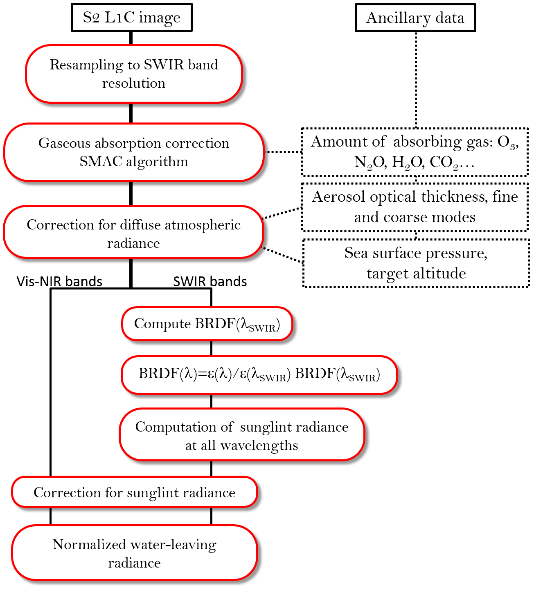

# GRS algorithm package
## GRS (Glint Removal for Sentinel-2-like sensors)

...

see [Harmel et al., 2018](https://www.sciencedirect.com/science/article/pii/S0034425717304856)



## Getting Started

These instructions will get you a copy of the project up and running on your local machine for development and testing purposes. See deployment for notes on how to deploy the project on a live system.

### Prerequisites

[Register](https://apps.ecmwf.int/registration/) and [ask for a key](https://confluence.ecmwf.int/display/WEBAPI/Accessing+ECMWF+data+servers+in+batch#AccessingECMWFdataserversinbatch-key) to use ECMWF API

Download and install the [SNAP software](http://step.esa.int/main/download/). 
Configure the [SNAP-python interface](https://senbox.atlassian.net/wiki/spaces/SNAP/pages/50855941/Configure+Python+to+use+the+SNAP-Python+snappy+interface) 
and link the obtained `snappy` folder to your python site-packages as `esasnappy`. For example:

```bash
ln -s /FULL_PATH/.snap/snap-python/snappy /PATH_TO_LIB_PYTHON/lib/python3.6/site-packages/esasnappy
```


Compilers such gcc and gfortran are needed to install the package.
 
Bindings are made based on F2PY. Please update the version of F2PY accordingly to your python version 
in [Makefile](Makefile); for instance:

``` 
export F2PY=f2py3.6
```

Compile all C and fortran files into shared libraries:

```
make
```

Generate the `config.py` file:
 * In the ./grs/grs folder, copy `config_local.py` to `config.py`. 
 
 * Then, edit `config.py` according to your folders tree and path to your grs installation folder. 


### Installing

To install the package:
```
python setup.py install
```

or 

```
python setup.py install --user
```

If the installation is successful, you should have:
```

$ grs
Usage:
  grs <input_file> [--sensor <sensor>] [-o <ofile>] [--odir <odir>] [--shape <shp>] [--wkt <wktfile>]   [--longlat <longmax,longmin,latmax,latmin> ]    [--altitude=alt] [--dem] [--aerosol=DB] [--aeronet=<afile>]    [--aot550=aot] [--angstrom=ang] [--output param]   [--resolution=res] [--levname <lev>] [--no_clobber] [--memory_safe] [--unzip]
  grs -h | --help
  grs -v | --version
```

### On the PBS cluster : installing from sources with conda on the cluster CNES

Create the conda environment using the definition file available in the conda folder :
```
conda env create -f conda/grs_conda_3.6.yml -p /work/scratch/$user/grs_py3.6
````
The option -p set the directory where the conda environment will be installed

To install the package grs in conda :

```
source conda/conda_grs.sh -ci
```


To launch GRS on a pbs node :

```
qsub launch_grs_exemple.pbs
```

## Running the tests
From terminal:
```
grs test/data/S2B_MSIL1C_20180927T103019_N0206_R108_T31TGK_20180927T143835.SAFE --shape test/data/shape/SPO04.shp --odir test/results/ --aerosol cams_forecast --dem --resolution 20
```
You should get something like:


Another examples of output images before (1st column) and after  (2nd column) sunglint correction:


## Deployment

See examples in [exe](exe).

## Contributing

Please contact [authors](tristan.harmel@ntymail.com) for details on our code of conduct, and the process for submitting pull requests to us.

## Authors

* **Tristan Harmel** - *Initial work* - [contact](tristan.harmel@ntymail.com)

See also the list of [contributors](...) who participated in this project.

## License

This project is licensed under the MIT License - see the [LICENSE.md](LICENSE.md) file for details

## Acknowledgments

* The [Step forum](http://forum.step.esa.int) and Marco Peters are acknowledged for their useful help to process Sentinel-2 data
with the snappy API.
* The authors are very grateful to Olivier Hagolle
for providing open source codes to perform gaseous absorption correction and massive Sentinel-2 data download.
