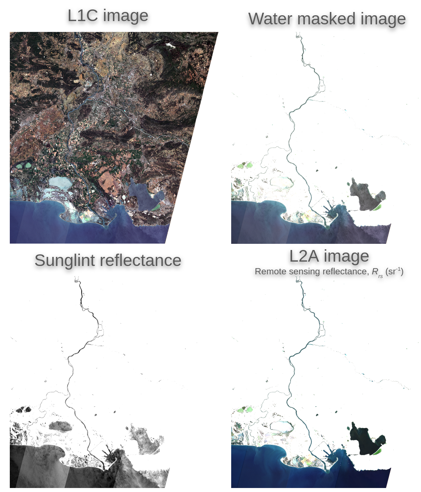

.. GRS documentation master file, created by
   sphinx-quickstart on Fri Mar  8 11:27:53 2024.
   You can adapt this file completely to your liking, but it should at least
   contain the root `toctree` directive.

GRS documentation
===============================

GRS (Glint Removal for Sentinel-2-like sensors)
-------------------------------------------------

The GRS algorithm `Harmel et al.,
(2018) <https://www.sciencedirect.com/science/article/pii/S0034425717304856>`__
was specifically developed to handle and correct for the direct sunlight reflected by the water surface and potentially reaching the sensor (i.e.,
sunglint signal) of Sentinel-2-like mission, that is nadir or near-nadir viewing sensor with SWIR bands. The GRS
processor consists of three main modules to correct for:

- gaseous absorption,
- diffuse light from sky and its reflection by the air-water interface and
- the sunglint signal in order to retrieve the water-leaving signal at the water surface level.

.. toctree::
   :maxdepth: 3
   :caption: Getting started:

   usage

.. toctree::
   :maxdepth: 2
   :caption: Tutorials

   examples/basics
   examples/auxdata
   examples/advanced
   examples/visualization

.. toctree::
   :maxdepth: 3
   :caption: GRS API
   :hidden:

   api

API reference
-------------

.. autosummary::
   :template: custom-module-template.rst

   grs.acutils
   grs.auxdata
   grs.cams
   grs.data
   grs.grs_process
   grs.mask
   grs.output
   grs.product
   grs.run

.. toctree::
   :maxdepth: 1
   :caption: For Contributors
   :hidden:

   history

Interactive data manipulation
=============================

Please see the GRS Toolbox package `grstbx <https://github.com/Tristanovsk/grstbx>`__

.. figure:: _static/grstbx_visual_tool.gif
   :alt: animated_dashboard

Indices and tables
==================

* :ref:`genindex`
* :ref:`modindex`
* :ref:`search`

.. toctree::
   :maxdepth: 1
   :caption: Funding

   support
